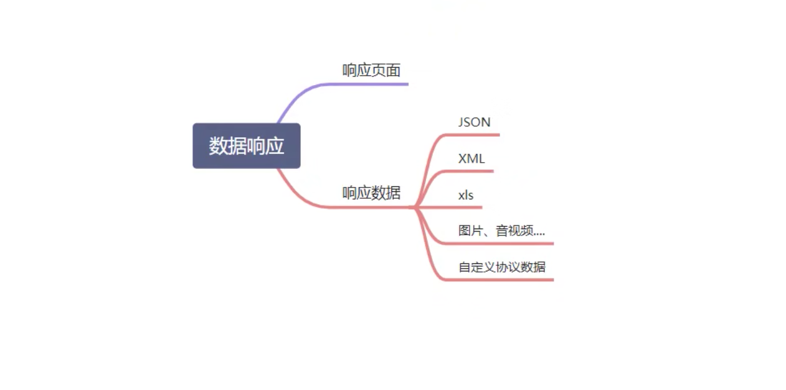

### 一、SpringBoot核心技术-基础入门

#### 1、Spring和SpringBoot

* 为什么使用Springboot
  * 能够快速创建出生产级别的Spring应用

* SpringBoot优点

  * 创建独立Spring应用

  * 内嵌web服务器

  * 自动starter依赖，简化构建配置

  * 自动配置Spring以及第三方功能

  * 提供生产级别的监控、监控检查即外部化配置

  * 无代码生成、无需编写XML

* SpringBoot缺点

  * 人称版本帝，迭代快，需要时刻关注变化

  * 封装太深，内部原理复杂，不容易精通

#### 2、时代背景

* 微服务
  * 微服务是一种架构风格
  * 一个应用拆分为一组小型服务
  * 每隔服务运行在自己的进程内，也就是可独立部署和升级
  * 服务器之间使用轻量级HTTP交互
  * 服务围绕业务功能拆分
  * 可以由全自动部署机制独立部署
  * 去中心化，服务自治，服务可以使用不通的语言、不同的语言、不通的存储技术
* 分布式
  * 分布式困难
    * 远程调用
    * 服务发现
    * 负载均衡
    * 服务容错
    * 配置管理
    * 服务监控
    * 链路追踪
    * 日志管理
    * 任务调度
  * 分布式解决
    * SpringBoot+SpringCloud	
* 云原生
  * 原生应用如何上云。Cloud Native
  * 上云的困难
    * 服务自愈
    * 弹性伸缩
    * 服务隔离
    * 自动化部署
    * 灰度发布
    * 流量治理

### 二、SpringBoot2入门

#### 1、创建工程

* > 运行jar包
  >
  > java -jar springboot-1.0-SNAPSHOT.jar

#### 2、创建主程序

```java
@SpringBootApplication
public class MainApplication {
    public static void main(String[] args) {
        SpringApplication.run(MainApplication.class);
    }
}
```

#### 3、测试

* 直接运行main方法

#### 4、简化配置

* application.ym或application.properties

#### 5、简化部署

* 引入插件

```xml
<build>
    <plugins>
        <plugin>
            <groupId>org.springframework.boot</groupId>
            <artifactId>spring-boot-maven-plugin</artifactId>
        </plugin>
    </plugins>
</build>
```

* 把项目打成jar包，直接在目标服务器执行即可
* 注意点
  * 取消掉cmd的快速编辑模式

### 三、了解自动配置原理

#### 1、springboot特点

* 依赖管理

  * 父项目依赖管理

  ```xml
  <parent>
      <groupId>org.springframework.boot</groupId>
      <artifactId>spring-boot-starter-parent</artifactId>
      <version>2.6.7</version>
  </parent>
  <!--他的父项目-->
  <parent>
      <groupId>org.springframework.boot</groupId>
      <artifactId>spring-boot-dependencies</artifactId>
      <version>2.6.7</version>
    </parent>
  
  <!--几乎声明所有的依赖版本-->
  ```

* starter场景启动器

  * 只要引入starter,这个场景需要的所有常规引入我们都自动引入
  * SpringBoot所有支持的场景<https://docs.spring.io/spring-boot/docs/current/reference/html/using.html#using.build-systems.starters>

* 自动配置

  * 自动配好Tomcat
    * 引入Tomcat依赖
    * 配置Tomcat
  * 自动配好SpringMVC
    * 引入SpringMVC全套组件
    * 自动配好SpringMVC常用组件（功能）
  * 自动配Web常见功能，如：字符编码问题
    * SpringBoot帮我们配置好了所有web开发的常见场景
  * 默认包结构
    * 主程序所在包及其下面的子包都能被扫描
    * 无需以前的包扫描配置
    * 想要改变需要使用包扫描
  * 各种配置拥有默认值
    * 默认配置最终都是映射到MultipartProperties
    * 配置文件的值最终会绑定每个类上，这个类会在容器中创建对象
  * ​	按需加载所有自动配置项
    * 非常多的starter
    * 引入了哪些场景，这个场景的自动配置才会开启
    * SpringBoot所有的自动配置功能都在spring-boot-autoconfigure包里面

#### 2、容器功能

* 组件添加

  * @Configuration

  ```java
  /**
   * @Date 2022/5/1
   * @Author smc
   * @Description:告诉SpringBoot这个是配置文件
   * 配置类里面使用@Bean标注在方法上注册组件，默认是单实例的
   * 配置类本身也是组件
   * proxyBeanMethods:full模式和Lite模式
   *     true:运行时组件方法是都会判定是否容器中有该组件，有则返回该组件。
   *     false：每次运行都会创建新的组件
   *     即配置类组件间的依赖关系是lite模式时加速启动过程，减少判断
   *     配置类组件间的依赖是Full模式时，方法会调用之前的单实例
   */
  @Configuration(proxyBeanMethods = true)
  public class MyConfig {
      /**
       * 给容器添加组件，此方法名作为bean的id，返回值为容器中的实例
       * @return
       */
      @Bean
      public User user(){
          return new User("张三",18);
      }
  
  
      @Bean("tom")
      public Pet pet(){
          return new Pet("tomcat");
      }
  }
  ```

  * @Bean、@Component、@Controller、@Service、@Repository
  * @ComponentScan、@Import

  ```java
  //给容器中自动穿件出这个两个类型的组件、默认组件的名字就是全类名
  @Import({User.class, SimpleObjectIdResolver.class})
  
  
  ```

  * @Conditional

    * 满足Conditional指定的条件，则进行组件注入

    > ```java
    > //根据是否包含tom这个组件来判断是否生成组件
    > @ConditionalOnBean(name = "tom")
    > ```

* 原生配置文件引入

  * @ImportResource

    > ```java
    > //添加配置文件
    > @ImportResource("classpath:beans.xml")
    > ```

* 配置绑定

  * 如何使用Java读取到properties文件中的内容，并且把它封装到JavaBean中，以供随时使用
  * @ConfigurationProperties+@Component

  ```java
  @Data
  @Component
  @ConfigurationProperties(prefix = "admin")
  public class Admin {
      private String name;
      private Integer age;
  }
  
  @RestController
  public class HelloController {
      @Autowired
      private Admin admin;
  
      @RequestMapping("returnAdmin")
      public Admin returnAdmin(){
          return admin;
      }
  }
  ```

  ```yaml
  admin:
    name: root
    age: 18
  ```

  * EnableConfigurationProperties()+@ConfigurationProperties

  ```java
  @Configuration()
  @EnableConfigurationProperties(Admin.class)
  //开启Admin配置绑定功能
  //把这个Admin自动注册到容器中
  public class MyConfig {}
  
  
  @Data
  @ConfigurationProperties(prefix = "admin")
  public class Admin {
      private String name;
      private Integer age;
  }
  ```

#### 3、自动配置原理入门

* 引导加载自动配置类

  ```java
  @SpringBootConfiguration
  @EnableAutoConfiguration
  @ComponentScan(
      excludeFilters = {@Filter(
      type = FilterType.CUSTOM,
      classes = {TypeExcludeFilter.class}
  ), @Filter(
      type = FilterType.CUSTOM,
      classes = {AutoConfigurationExcludeFilter.class}
  )}
  )
  public @interface SpringBootApplication {}
  ```

  * @SpringBootConfiguration

    * @Configuration,代表当前是一个配置类

  * @ComponentScan

    * 指定扫描哪些，Spring注解

  * @EnableAutoConfiguration

    ```java
    @AutoConfigurationPackage
    @Import({AutoConfigurationImportSelector.class})
    public @interface EnableAutoConfiguration {
        String ENABLED_OVERRIDE_PROPERTY = "spring.boot.enableautoconfiguration";
    
        Class<?>[] exclude() default {};
    
        String[] excludeName() default {};
    }
    ```

    * @AutoConfigurationPackage

    > 利用Registear给容器中导入一系列组件
    >
    > 将指定的启动类包下的所有组件导入进来

    * @Import({AutoConfigurationImportSelector.class})

    > 1、利用getAutoConfigurationEntry(annotationMetadata);给容器中批量导入一些组件
    >
    > 2、调用List<String> Configuration = getCandidateConfigurations(annotationMetadata,attributes)获取到所有需要导入到容器中
    >
    > 3、利用工厂加载Map<String,List<String>> loadSpringFactories(@Nullable ClassLoader classLoader)得到所有组件
    >
    > 4、从META-INF/spring.factories位置来加载一个文件。默认扫描我们当前系统管理面所有META-INF/spring.factories位置的文件spring-boot-autoconfigure-2.3.4.RELEASE.jar
    >
    > 5、文件里面写死了spring-boot，一启动就要给容器中加载的所有配置类

* 按需开启自动配置项

  * 虽然所有尝尽的所有自动配置启动的时候默认加载
  * 按照条件转配规则**@Conditional**进行配置

* 修改默认配置

  ```java
  @Bean
  @ConditionalOnBean({MultipartResolver.class})//容器中更有这个类型的组件
  @ConditionalOnMissingBean(
      name = {"multipartResolver"}
  )//容器中没有这个名字的multipartResolver
  public MultipartResolver multipartResolver(MultipartResolver resolver) {
    //给@Bean标注的方法传入对象参数，这个参数的值就会从容器中找
    //防止有些用户配置的bean不符合规范
      return resolver;
  }
  ```

  * SpringBoot默认会在底层配好所有的组件。但是如果用户自己配置了以用户的优先

  * 总结

    * SpringBoot先加载所有的自动配置类xxxxAutoConfiguration
    * 每个自动；配置类按照条件进行生效，默认都会配置文件的指定值，xxxxProperties里面拿。xxxxProperties和配置文件进行了绑定
    * 生效的配置类就会给容器中装配很多组件
    * 只要容器中有这些组件，相当于这些功能就有了
    * 只要用户有自己配置的，就以用户的优先
      * 用户直接自己@Bean替换底层组件
      * 用护去看这个组件是获取的配置文件什么值就去修改

    > xxxxAutoConfiguration -> xxxxProperties -> 配置文件

* 最佳实践
  * 引入场景依赖
  * 查看自动配置了哪些
    * 配置文件中debug=true。Nagative(不生效)/Positive(生效)
  * 是否需要修改
    * 参照文档修改配置项
    * 自定义加入或者替换组件

#### 4、开发技巧

* lombok
* devtools
  * 热更新
* spring initalizr

### 四、核心功能

#### 1、配置文件

##### a、文件类型

* properties：同以前的properties用法

* yaml

  * 简介：YAML是“YMAL Ain't Markup Language”（YAML不是一种标记语言）的递归缩写。在卡法的这种语言时，YAML的意思其实是：“Yet Another Markup Language”（仍是一种标记语言）

  * 非常适合用来做以数据为中心的配置文件

  * 基本语法

    * key：value；kv之间有空格
    * 大小写敏感
    * 使用缩进来表示层级关系
    * 缩进不允许使用tab，只允许空格
    * 缩进的空格数不重要，只要相同层级的元素左对齐即可
    * “#”表示注释
    * ' '与"" 表示字符串内容，会被 转义/不转义

  * 数据类型

    * 字面量：单个的，不可在分的值。data、boolean、string、number、null

    > k: v

    * 对象：键值对的集合。map、hash、set、object

    > 行内写法：k: {k1: v1,k2:v2,k3: v3}
    >
    > 或
    >
    > k:
    >
    > ​	k1: v1
    >
    > ​	k2: v2
    >
    > ​	k3: v3

    * 数组：一组按次序排列的值。array、list、queue

    > 行内写法：k: [v1,v2,v3]
    >
    > 或
    >
    > k:
    >
    > ​	\- v1
    >
    > ​	\- v2
    >
    > ​	\- v3

  * properties的优先级高于yml

  * 自定义类绑定的配置提示

  ```xml
  <dependency>
              <groupId>org.springframework.boot</groupId>
              <artifactId>spring-boot-autoconfigure-processor</artifactId>
          </dependency>
  ```

#### 2、Web开发

##### a、SpringMVC自动配置概览

* 内容协商视图解析器和BeanName视图解析器
* 静态资源（包括webjars）
* 自动注册
* 支持HttpMessageConverters
* 自动注册MessageCodesResolver（国际化用）
* 静态index.html页支持
* 自定义Favicon
* 自动使用ConfigurableWebBindingInitializer，（DataBinder负责将请求数据绑定到JavaBean上）
  * 不用EnableWebMvc注解。使用@Configuration+WebMvcConfiguraer自定义规则
  * 使用@EnableWebMvc—+DelegatingWebMvcConfiguration全面接管SpringMVC

##### b、简单功能分析

* 静态资源访问

  * 静态资源目录：/static（or /public or /resources or /META-INF/resources）
    * 访问：当前项目根路径/+静态资源名
    * 原理：静态映射/**
    * 请求进来，先去找Controller看能不能处理。不能处理的所有请求又都交给静态资源处理器。静态资源也找不到就404
  * 静态资源访问前缀

  ```yaml
  spring:
    mvc:
      static-path-pattern: /static/**
  ```

  * 自定义静态资源默认路径

  ```yaml
  spring:
    web:
      resources:
        static-locations: [classpath:/haha/]
  ```

  * webjars自动映射

* 欢迎页支持

  * 给静态资源路径下 index.html

    * 可以配置静态资源路径
    * 但是不可以配置静态资源的访问前缀。否则导致index.html不能被默认访问

    ```yaml
    #回导致欢迎页失效
      mvc:
        static-path-pattern: /static/**
    ```

  * controller能处理/index

* 自定义favicon.ico

  * 只要在静态文件路径下放置favicon.ico
  * 注意清除缓存

* 静态资源配置原理

  * SpringBoot启动默认加载xxxAutoConfiguration类（自动配置类）
  * SpringMVC功能的自动配置类WebMVCAutoConfiguration
  * 给容器中配了什么

##### c、请求参数处理

* 请求映射

  * @xxxMapping

  * Rest风格（使用HTTP请求方式动词来表示对资源的操作）

  * 核心Filter：HiddenHttpMethodFilter

    * 用法：表单method=post，隐藏域_mehtod=put
    * 在配置文件中手动开启

    ```yaml
    spring:
      mvc:
        hiddenmethod:
          filter:
            enabled: true
    ```

  * Rest原理（表单提交要使用Rest的时候）
    * 表单提交会带上_method=PUT
    * 请求过来被HiddenHttpMethodFilter拦截
      * 请求是否正常并且是POST
        * 获取到_method的值
        * 原生request（post），包装模式requestWrapper重写了getgetMethod方法，返回的是传入的值
        * 过滤器链放心的时候用wrapper。以后的方法调用getMethod是调用requestWrapper的。
  * Rest使用客户端工具
    * 如PostMan直接发送Put、delete方式，无需Filter
  * GetMapping()、PostMapping()、PutMapping()、DeleteMapping()
  * 如何改变_method为自己的名字

  ```java
  @Configuration(proxyBeanMethods = false)
  public class WebConfig {
      @Bean
      public HiddenHttpMethodFilter hiddenHttpMethodFilter(){
          HiddenHttpMethodFilter hiddenHttpMethodFilter = new HiddenHttpMethodFilter();
          hiddenHttpMethodFilter.setMethodParam("_m");
          return hiddenHttpMethodFilter;
      }
  }
  
  ```

* 请求映射原理

  > HttpServlet

  * 所有的请求映射都在HandlerMapping中
    * SpringBoot自动配置欢迎页的WelcomePageHandlerMapping。访问/能访问到index.html
    * spingBoot自动配置了默认的RequestMapping、HandlerMapping
    * 请求进来，挨个尝试所有的HandlerMapping看是否有请求信息
      * 如果有就找到这个请求对应的handler
      * 如果没有就是下一个HandlerMapping
  * 我们需要一些自定义的映射处理，我们也可以自己给容器中放HandlerMapping。自定义HandlerMapping

* 普通参数与基本注解

  * 注解

    * @PathVariable

    * @RequestHeader：获取请求头总的参数值

    * @ModelAttribute：获取request域中的属性

    * @RequestParam

    * @MatrixVariable（矩阵变量）：

      * 矩阵变量需要在SpringBoot中手动开启;

      ```java
      //第一种开启方式
      @Configuration(proxyBeanMethods = false)
      public class WebConfig implements WebMvcConfigurer {
      
          @Override
          public void configurePathMatch(PathMatchConfigurer configurer) {
              UrlPathHelper urlPathHelper = new UrlPathHelper();
              urlPathHelper.setRemoveSemicolonContent(false);
              configurer.setUrlPathHelper(urlPathHelper);
          }
      }
      
      //第二种
      @Configuration(proxyBeanMethods = false)
      public class WebConfig {
          @Bean
          public WebMvcConfigurer webMvcConfigurer(){
              return new WebMvcConfigurer() {
                  @Override
                  public void configurePathMatch(PathMatchConfigurer configurer) {
                      UrlPathHelper urlPathHelper = new UrlPathHelper();
                      urlPathHelper.setRemoveSemicolonContent(false);
                      configurer.setUrlPathHelper(urlPathHelper);
                  }
              };
          }
      }
      ```

      

      * 根据RFC3986的规范，矩阵变量应当绑定在路径变量中
      * 若是有多个矩阵变量，应当使用英文符号；进行分割
      * 若是一个矩阵变量有多个值，应当使用英文符号“,”进行分割，或命名多个重复的key即可

      > 语法：car/sell;key1=value1;key2=value2

      * 手动启动：原理。对于路径的处理。UrlPathHelper进行解析。emoveSemicolonContent（移除分号内容）支持矩阵变量的

    * @CookieValue：获取CookieValue的值

    * @RequestBody：获取post请求中的数据

  * Servlet API

    * WebRequest、ServletRequest、MultipartRequest、HttpSession、javax.servlet.http.PushBuilder、Principal、InputStream、Reader、HttpMethod、Locale、TimeZone、ZoneId

  * 复杂参数

    * Map、Errors/BindingResult、Model、RedirectAttributes、ServletResponse、SessionStatus、UriComponentsBuilder、ServletUriComponentsBuilder
    * Map、Model类型的参数：会返回mavCOntainer.getModel()；-->BindingAwareModelMap是Model也是Map
    * mavContainer.getModel();获取到值的

  * 自定义对象参数

    * 可以自动类型转换与格式化，可以级联封装

    > WebDataBinder binder = binderFactory.createBinder(webRequest,attribute,name)
    >
    > WebDataBinder:web数据绑定器，将请求参数的值绑定到制定的JavaBean里面
    >
    > WebDataBinder利用它里面的Converters将请求数据转成制定的数据类型。在此封装到JavaBean中

    * GenericConversionService：在设置每个值时候，找他连的所有converter哪个可以将这个数据类型（request带来字符串）转成制定的类型（JavaBean--Integer）

    ```java
    @Bean
        public WebMvcConfigurer webMvcConfigurer(){
            return new WebMvcConfigurer() {
                @Override
                public void addFormatters(FormatterRegistry registry) {
                    registry.addConverter(new Converter<String, Pet>() {
    
                        @Override
                        public Pet convert(String source) {
                            if (!StringUtils.hasLength(source)){
                                Pet pet = new Pet();
                                String[] split = source.split(",");
                                pet.setName(split[0]);
                                pet.setAge(Integer.valueOf(split[1]));
                                return pet;
                            }
                            return null;
                        }
                    });
                }
            };
        }
    ```

##### d、数据响应和内容协商

* 数据响应

  * 响应JSON
    * jackson.jar+@ResponseBody
    * 给前端自动发送JSON数据
  * 返回值解析器
    * 返回值处理器判断是否支持这种类型的返回值supportsReturnType
    * 返回值处理器调用handleReturnValue进行处理
    * RequestResponseBodyMethodProcessor可以处理返回值标了@ResponseBody注解的。
      * 利用MessageConverters进行处理，将数据写为JSON
        * 内容协商（浏览器默认会以请求头的方式告诉服务器他能接受什么样的内容类型）
        * 服务器最终根据自身的能力，决定服务器能生产出什么样的内容数据
        * SpringMVC会挨个便利所有底层的HttpMessageConverter，看谁能处理？
          * 得到MappingJackson2HttpMessageConverter可以将对象写为json
          * 利用MappingJackson2HttpMessageConverter将对象转为json再写出去
  * SpringMVC支持哪些返回值
    * ModelAndView
    * Model
    * View
    * ResponseEntity
    * ResponseBodyEmitter
    * StreamingResponseBody
    * HttpEntity
    * HttpHeaders
    * Callable
    * DeferredResult
    * ListenableFuture
    * CompletionStage
    * WebAsyncTask
    * 有 @ModelAttribute
    * @ResponseBody注解

  * HTTPMessageConverter原理
    * 规范：
      * 看是否支持将此class类型的对象，转为MediaType类型的数据。例：Person对象转为JSON，或者JSON转为Person

* 内容协商:根据客户端接受能力不通，返回不通媒体类型的数据

  * 引入xml依赖
  * 只要改变请求头中的accept字段。Http协议中规定的，告诉服务器本客户端可以接收的数据类型。
  * 内容协商原理
    * 判断当前响应头中是否已经有确定的媒体类型。MediaType
    * 获取客户端（PostMan、浏览器）支持的内容类型（获取客户端Accepte请求头字段）
      * contentNegotiationManager内容协商管理器，默认使用基于请求头的策略
      * 确定客户端能够接收的内容类型
    * 遍历循环所有当前系统的MessageConverter，看水支持操作Person
    * 找到支持操作Person的converter，把converter支持的媒体类型统计出来
    * 客户端需要【application/xml】。服务端能力【10种、json、xml】
    * 进行内容协商的最佳匹配媒体类型
    * 用支持将对象转华为最佳匹配媒体类型的converter。调用它进行转化

  ```xml
  <!--能够接收处理和返回xml类型数据-->
  <dependency>
    <groupId>com.fasterxml.jackson.dataformat</groupId>
    <artifactId>jackson-dataformat-xml</artifactId>
  </dependency>
  ```

  

* 开启浏览器参数方式内容协商功能

  ```yaml
  #开启
  spring:
      contentnegotiation:
        favor-parameter: true
  #http://localhost:8888/test/person?format=xml
  ```

* 自定义MessageConverter

  * 实现多协议数据兼容、json、xml
    * @ResponseBody响应数据出去，调用RequestResponseBodyMethodProcessor处理
    * Processor处理方法返回值。通过MessageConverter处理
    * 所有MessageConverter合起来可以支持各种媒体类型数据的操作（读、写）
    * 内容协商找到最终的messageConverter

  > 1、浏览器发送请求直接返回xml 【application/xml【jacksonXmlConverter】
  >
  > 2、如果是ajax请求返回json 【application/json】【jacksonJsonConverter】
  >
  > 3、如果硅谷app发请求，返回自定义协议数据 【application/x-guigu】【xxxConverter】

  * 步骤

    * 添加自定义的MessageConverter进系统底层
    * 系统底层就会统计出所有MessageConverter能操作哪些类型
    * 客户端内容协商【guigu-->guigu】
    * springMVC的什么功能都是@Configuration来配置

    ```java
    @Configuration(proxyBeanMethods = false)
    public class WebConfig /*implements WebMvcConfigurer*/ {
        @Bean
        public WebMvcConfigurer webMvcConfigurer(){
            return new WebMvcConfigurer() {
    
                @Override
                public void extendMessageConverters(List<HttpMessageConverter<?>> converters) {
                    converters.add(new SmcMessageConverter());
                }
            };
        }
    }
    
    public class SmcMessageConverter implements HttpMessageConverter<Person> {
        @Override
        public boolean canRead(Class<?> clazz, MediaType mediaType) {
            return false;
        }
    
        @Override
        public boolean canWrite(Class<?> clazz, MediaType mediaType) {
            return clazz.isAssignableFrom(Person.class);
        }
    
        /**
         * 服务器要统计所有MessageConverter都能写出哪些内容类型
         *application/x-smc
         * @return
         */
        @Override
        public List<MediaType> getSupportedMediaTypes() {
    
            return MediaType.parseMediaTypes("application/x-smc");
        }
    
        @Override
        public Person read(Class<? extends Person> clazz, HttpInputMessage inputMessage) throws IOException, HttpMessageNotReadableException {
            return null;
        }
    
        @Override
        public void write(Person person, MediaType contentType, HttpOutputMessage outputMessage) throws IOException, HttpMessageNotWritableException {
            String data = person.getUserName()+";"+person.getAge()+";"+person.getBirth();
            //写出去
            OutputStream body = outputMessage.getBody();
            body.write(data.getBytes(StandardCharsets.UTF_8));
        }
    
    
    }
    ```

  * 基于参数的内容来返回自定义类型

  ```java
  @Configuration(proxyBeanMethods = false)
  public class WebConfig /*implements WebMvcConfigurer*/ {
      @Bean
      public WebMvcConfigurer webMvcConfigurer(){
          return new WebMvcConfigurer() {
              /**
               * 自定义内容协商策略
               * @param configurer
               */
              @Override
              public void configureContentNegotiation(ContentNegotiationConfigurer configurer) {
                  Map<String, MediaType> mediaTypes = new HashMap<>();
                  mediaTypes.put("json",MediaType.APPLICATION_JSON);
                  mediaTypes.put("xml",MediaType.APPLICATION_XML);
                  mediaTypes.put("x-smc",MediaType.parseMediaType("application/x-smc"));
  
                  //指定支持解析哪些参数对应的哪些媒体类型
                  ParameterContentNegotiationStrategy parameterStrategy = new ParameterContentNegotiationStrategy(mediaTypes);
                  configurer.strategies(Arrays.asList(parameterStrategy));
              }
          };
      }
  }
  ```

* 自定义了内容协商管理器后，请求头的自定义会失效，会变为默认**\*/\***。需要重新加

  ```java
  @Override
              public void configureContentNegotiation(ContentNegotiationConfigurer configurer) {
                  Map<String, MediaType> mediaTypes = new HashMap<>();
                  mediaTypes.put("json",MediaType.APPLICATION_JSON);
                  mediaTypes.put("xml",MediaType.APPLICATION_XML);
                  mediaTypes.put("x-smc",MediaType.parseMediaType("application/x-smc"));
  
                  //指定支持解析哪些参数对应的哪些媒体类型
                  ParameterContentNegotiationStrategy parameterStrategy = new ParameterContentNegotiationStrategy(mediaTypes);
                //重新加请求头的
                  HeaderContentNegotiationStrategy headerContentNegotiationStrategy = new HeaderContentNegotiationStrategy();
                  configurer.strategies(Arrays.asList(parameterStrategy,headerContentNegotiationStrategy));
              }
  ```

  * 通过配置文件配置参数

  ```yaml
  spring:
    web:
      contentnegotiation:
        media-types:
          x-smc: application/x-smc
  ```

  * 设置接口返回类型

  ```java
  @ResponseBody
  @GetMapping(value = "/test/person",produces = "application/x-smc")//设置数据返回类型
  public Person getPerson() {
    Person person = new Person();
    person.setUserName("张三");
    person.setAge(18);
    person.setBirth(new Date());
    person.setPet(new Pet());
    return person;
  }
  ```

  

##### e、视图解析和模版引擎

* 视图解析：SpringBoot默认不支持JSP，需要引入第三方模版引擎技术实现页面渲染

* 视图解析

  

* 视图解析原理流程

  * 目标方法处理的过程中，所有数据都会被放在ModelAndViewContainer里面。包括数据和视图地址
  * 方法的参数是一个自定义类型对象（从请求参数中确定的），会把他重新放在ModelAndViewContainer
  * 任何目标方法执行完成后，都会返回ModelAndView对象
  * processDispatchResult处理派发结果（页面该如何响应）
    * render(mv, request,response);进行页面渲染逻辑
      * 根据方法的String返回值得到View对象【定义了页面的渲染逻辑】
        * 所有的视图解析器尝试是否能根据当前返回值得到View对象
        * 得到了redirect/main.html -> Thymeleaf new RedirectView()
        * ContentNegotiationViewResolver里面包含了下面所欲的视图解析器，内部还是利用下面所有视图解析器得到视图对象
        * view.render(mv.getModelInternal(),request,response);视图对象调用自定义的render进行页面渲染工作
          * RedirectView如何渲染
            * 获取目标url地址
            * response.sendRedirect(encodeUrl)
    * 视图解析
      * 返回值以forward开始：new InteralResourceView(forwardUrl)
        * request.getRequestDispatcher(path).forward(request,response)转发
      * 返回值以redirect开始：new RedirectView(redirectView)
        * response.sendRedirect(encodeUrl)重定向
      * 返回值是普通字符串：new ThymeleafView() 

##### f、拦截器

* 定义拦截器

```java
/**
 * @Date 2022/5/7
 * @Author smc
 * @Description:
 * 1、配置好拦截器要拦截哪些请求
 * 2、把这些配置放在容器中
 */
@Slf4j
public class LoginInterceptor implements HandlerInterceptor {
    /**
     * 目标方法执行之前
     * @param request
     * @param response
     * @param handler
     * @return
     * @throws Exception
     */
    @Override
    public boolean preHandle(HttpServletRequest request, HttpServletResponse response, Object handler) throws Exception {
        log.info("被拦截的路径:"+request.getRequestURI());
        //登录检查逻辑
        HttpSession session = request.getSession();
        Object loginUser = request.getAttribute("loginUser");
        if (loginUser != null){
            return true;
        }
        //拦截住。未登录，跳转到登录页
        request.setAttribute("msg","请先登录");
        request.getRequestDispatcher("/").forward(request,response);
        return false;
    }

    /**
     * 目标方法执行之后
     * @param request
     * @param response
     * @param handler
     * @param modelAndView
     * @throws Exception
     */
    @Override
    public void postHandle(HttpServletRequest request, HttpServletResponse response, Object handler, ModelAndView modelAndView) throws Exception {
        HandlerInterceptor.super.postHandle(request, response, handler, modelAndView);
    }

    /**
     * 页面渲染之后
     * @param request
     * @param response
     * @param handler
     * @param ex
     * @throws Exception
     */
    @Override
    public void afterCompletion(HttpServletRequest request, HttpServletResponse response, Object handler, Exception ex) throws Exception {
        HandlerInterceptor.super.afterCompletion(request, response, handler, ex);
    }
}
```

* 在容器中注册拦截器

```java
/**
 * @Date 2022/5/7
 * @Author smc
 * @Description:
 * 1、编写一个拦截器实现HandlerInterceptor接口
 * 2、拦截器注册到容器中（实现WebMvcOnfigurer的addInterceptor）
 * 3、指定拦截规则【如拦截所有，静态资源也会被拦截】
 */
@Configuration
public class AdminWebConfig implements WebMvcConfigurer {
    @Override
    public void addInterceptors(InterceptorRegistry registry) {
        registry.addInterceptor(new LoginInterceptor())//所有请求都被拦截，包括静态资源
                .addPathPatterns("/**").excludePathPatterns("/","/login","/css/**","/js/**");//放行的请求
    }
}
```

* 拦截器的原理

  * 根据当前请求，找到HandlerExcutioChain中可以处理请求的handler以及handler的所有拦截器
  * 先来顺序执行所有拦截器的preHandler方法
    * 如果当前拦截器preHandler返回true，则执行下一个拦截器的preHandler
    * 如果当前拦截返回false，直接倒序执行所有已经执行了的拦截器的afterCompletion
  * 如果任何一个拦截器返回false，直接跳出不执行目标方法
  * 所有拦截器都返回true，则执行目标方法
  * 倒序执行所有所有拦截器的postHandler方法
  * 前面的步骤有任何异常都会直接触发afterCompletion
  * 页面成功渲染完成以后也会倒序出发afterCompletion

  

##### g、文件上传

* 文件上传代码

```java
/**
     * 自动封装上传过来的文件
     * @param email
     * @param username
     * @param headerImg
     * @param photos
     * @return
     */
    @PostMapping("/upload")
    public String upload(String email, String username,
                         @RequestPart("headImg") MultipartFile headerImg,
                         @RequestPart("photos") MultipartFile[] photos) throws IOException {
        log.info("上传的信息：email={},username={},headerImg={},photos={}",
                email,username,headerImg.getSize(),photos.length);
        if (!headerImg.isEmpty()){
            //保存到文件服务器，OSS服务器
            String originalFilename = headerImg.getOriginalFilename();
            headerImg.transferTo(new File("/static/"+originalFilename));
        }
        if (photos.length>0){
            for (MultipartFile photo : photos) {
                String originalFilename = photo.getOriginalFilename();
                photo.transferTo(new File("/static/photos/"+originalFilename));
            }
        }
        return "main";
    }
```

* 配置一个文件最大文件上传大小和一次请求最大文件大小（MultipartAutoConfiguration）

``` yaml
spring:
  servlet:
    multipart:
      max-file-size: 10MB
      max-request-size: 100MB
```

* 自动配置原理
  * 文件上传自动配置类-MultipartAutoConfiguration-MultipartProperties
    * 自动配置好了StandardServletMultipartResolver（文件上传解析器）
    * 原理步骤
      * 请求进来使用文件上传解析器判断并封装（resolveMultipart，返回MultipartHttpServletRequest）文件上传请求
      * 参数解析器来解析请求中的文件内容封装成MultipartFile
      * 将request中文件信息封装未一个map；MultiValueMap<String,MultipartFile>
    * FileCopyUtils.实现文件流的copy

##### h、异常处理

* 错误处理

  * 默认规则

    * 默认情况下，SpringBoot提供` /error`处理所有错误的映射
    * 对于机器客户端，它将生成JSON响应，其中包含错误，HTTP状态和异常消息的详细信息。对于浏览器客户端，响应一个"whitelabel"错误视图，以HTML格式呈现相同的数据
    * 要对其进行自定义，添加` View`解析` error`
    * 要完全替换默认行为，可以实现` ErrorController`并注册该类型的Bean定义，或添加` ErrorAttributes的组件`以使用现有机制替换其内容
    * error/下的4xx，5xx页面会被自动解析

  * 地址错误处理逻辑

    * 自定义错误页

      * error/404.html error/5xx.html，有精确错误状态码页面就匹配精确，没有就找4xx.html;如果都没有就出发白页

    * @ControllerAdvice+@ExceptionHandler处理异常**底层是ExceptionHandlerExceptionResolver支持的**

      ```java
      @Slf4j
      @ControllerAdvice
      public class GlobalExceptionHandler {
          @ExceptionHandler({ArithmeticException.class,NullPointerException.class})//处理异常
          public String handlerAtrithException(Exception e) {
              log.error("异常是：{}", e);
              //返回视图地址
              return "login";
          }
      }
      ```

      

    * @ResponseStatus+自定义异常:**底层是ResponseStatusExceptionResplver，把responsestatus注解的信息组装成ModelAndView返回；底层调用response.sendError(statusCode,resolvedReason);tomcat发送/error**

    ```java
    @ResponseStatus(value = HttpStatus.FORBIDDEN,reason = "用户数量过多")
    public class UserTooManyException extends RuntimeException{
        public UserTooManyException() {
        }
    
        public UserTooManyException(String message) {
            super(message);
        }
    }
    
    @GetMapping("/dynamic_table")
    public String dynamic_table(Model model){
      List<User> users = new ArrayList();
      if (users.size()>3){
        throw new UserTooManyException();
      }
      return "form/form_layout";
    }
    ```

    

    * spring底层的异常，如参数类型转换异常:`DefaultHandlerExceptionResolver`处理框架底层的异常
      * response.sendError(HttpServletResponse.SC_BAD_REQUEST,ex.getMessage());
    * 自定义实现HandlerExceptionResolver处理异常；可以作为默认的全局异常处理规则

    ```java
    @Order(value = Ordered.HIGHEST_PRECEDENCE)//优先级，数字越小优先级越高
    @Component
    public class CustomerHandlerExceptionResolver implements HandlerExceptionResolver {
        @Override
        public ModelAndView resolveException(HttpServletRequest request,
                                             HttpServletResponse response,
                                             Object handler, Exception ex) {
            try {
                response.sendError(511,"我喜欢的错误");
            } catch (IOException e) {
                e.printStackTrace();
            }
            return new ModelAndView();
        }
    }
    
    ```

    

    * ErrorViewResolver实现自定义处理异常
      * `response.sendError`error请求会转给controller
      * 你的异常没有任何人能处理。tomcat底层response.sendError.error请求会转给controller
      * basicErrorController要去的页面地址是ErrorViewResolver

  * 异常处理自动配置原理

    * ` ErrorMvcAutoConfiguration`自动配置处理异常规则

      * 容器中的组件类型：` DefaultErrorAttributes`->` id:errorAttributes`

        * ` public class DefaultErrorAttributes implements ErrorAttributes, HandlerExceptionResolver, Ordered {`
        * `DefaultErrorAttributes`:定义错误页面中可以包含哪些数据

      * 容器中的组件：类型：` BasicErrorController` -->` id:basicErrorController`（json或view页面）

        * 处理默认/error路径的请求

        * ```
          @RequestMapping({"${server.error.path:${error.path:/error}}"})
          public class BasicErrorController extends AbstractErrorController {
          ```

        * 容器中有组件View->id是error(响应默认错误页)

        * 容器中放组件的BeanNameViewResolver（视图解析器）；按照返回的视图名作为组件的id去容器中找View对象

      * 容器中的组件：类型：`DefaultErrorViewResolver`->id:`conventionErrorViewResolver`

        * 如果发生错误，会以HTTP的状态码作为视图页地址（viewname），找到真正的页面

    * 如果想要返回页面，就会找error视图【StaticView】。（默认是一个白页）

* 异常处理步骤流程

  * 执行目标方法，目标方法运行期间有任何异常都会被catch，而且标志当前请求结束；并且用dispatchException
  * 进入视图解析流程（页面渲染）：processDispatchResult（processedRequest,response,mappedHandler,mv,dispatchException）
  * mv = processHandlerException：处理handler发生的异常，处理完成返回ModelAndView
    * 遍历所有的handlerExceptionResolvers，看谁能处理当前异常【HandlerExceptionResolver处理器异常解析器】
    * 系统默认的异常
      * DefaultErrorAttributes先来处理异常，把异常信息保存到request域，并返回null
      * 默认没有任何人能处理异常，则抛出去
        * 如果没有任何人能够处理，最终底层发送/error请求。会被底层的BasicErrorController处理
        * 解析错误视图：遍历所有ErrorViewResolver看谁能解析
        * 默认的DefaultErrorViewResolver，作用是把响应状态码作为错误页的地址，如error/500.html
        * 模版引擎最终响应这个页面error/500.html

##### h、Web原生组件注入（Servlet、Filter、Listener）

* 使用ServletAPI

  * `@ServletComponentScan(basePackages = "com.smc.boot.servlet")`:指定原生Servlet的扫描目录

  ```java
  @WebServlet(urlPatterns = "/my")
  public class MyServlet extends HttpServlet {
      @Override
      protected void doGet(HttpServletRequest req, HttpServletResponse resp) throws ServletException, IOException {
          resp.getWriter().write("myServlet");
      }
  }
  ```

  ```java
  @Slf4j
  @WebFilter(urlPatterns = {"/css/*","/image/*"})
  public class MyFilter implements Filter {
      @Override
      public void init(FilterConfig filterConfig) throws ServletException {
          log.info("MyFilter初始化了");
      }
  
      @Override
      public void doFilter(ServletRequest servletRequest, ServletResponse servletResponse, FilterChain filterChain) throws IOException, ServletException {
          log.info("MyFilter工作");
          filterChain.doFilter(servletRequest,servletResponse);
      }
  
      @Override
      public void destroy() {
          log.info("MyFilter销毁");
      }
  }
  ```

  ```java
  @Slf4j
  @WebListener
  public class MyServletContextListener implements ServletContextListener {
      @Override
      public void contextInitialized(ServletContextEvent sce) {
          log.info("MyServletContextListener监听到项目初始化完成");
      }
  
      @Override
      public void contextDestroyed(ServletContextEvent sce) {
          log.info("MyServletContextListener监听到项目销毁");
      }
  }
  ```

* 使用RegistrationBean

​	`ServletRegistrationBean`,`FilterRegistrationBean`,`ServletListenerRegistrationBean`

```java
@Configuration
public class MyRegistConfig {

    @Bean
    public ServletRegistrationBean myServlet(){
        MyServlet myServlet = new MyServlet();
        return new ServletRegistrationBean(myServlet,"/my","/my02");
    }

    @Bean
    public FilterRegistrationBean myFilter(){
        MyFilter myFilter = new MyFilter();
//        return new FilterRegistrationBean<>(myFilter,myServlet());
        FilterRegistrationBean<MyFilter> myFilterFilterRegistrationBean = new FilterRegistrationBean<>(myFilter);
        myFilterFilterRegistrationBean.setUrlPatterns(Arrays.asList("/my","/css/*"));
        return myFilterFilterRegistrationBean;
    }

    @Bean
    public ServletListenerRegistrationBean myListener(){
        MyServletContextListener myServletContextListener = new MyServletContextListener();
        return new ServletListenerRegistrationBean(myServletContextListener);
    }
}
```

* 扩展：`DispatcherServlet`如何注册进来

  * 容器中自动配置了`DispatcherServlet`属性绑定到WebMvcProperties；对应的配置文件配置项是`spring.mvc`
  * 通过ServletRegistrationBean\<DispatcherServlet\>把DispatcherServlet配置进来
  * 默认映射的是/路径

  

##### i、嵌入式Servlet容器

* 切换嵌入式Servlet容器

  * 切换到其他服务器

    ```xml
    <dependency>
      <groupId>org.springframework.boot</groupId>
      <artifactId>spring-boot-starter-web</artifactId>
      <exclusions>
        <exclusion>
          <groupId>org.springframework.boot</groupId>
          <artifactId>spring-boot-starter-tomcat</artifactId>
        </exclusion>
      </exclusions>
    </dependency>
    <dependency>
      <groupId>org.springframework.boot</groupId>
      <artifactId>spring-boot-starter-undertow</artifactId>
    </dependency>
    ```

  * 原理

    * SpringBOot应用启动发现当前式Web应用。web场景包-导入tomcat
    * web应用会创建一个web版ioc容器`ServletWebServerApplicationContext`
    * `ServletWebServerApplicationContext`启动的时候寻找`ServletWebServerFactory(Servlet的web服务器工厂 --> Servlet的web服务器)`
    * Springboot底层默认有很多的WebServer工厂`UndertowServletWebServerFactory`,`JettyServletWebServerFactory`,`TomcatServletWebServerFactory`
    * 底层会有一个自动配置类`ServletWebServerFactoryAutoConfiguration`
    * `ServletWebServerFactoryAutoConfiguration`导入类`ServletWebServerFactoryConfiguration(配置类)`
    * `ServletWebServerFactoryConfiguration`配置类根据动态判断系统中到底导入了那个web服务器的包，默认是web-startertomcat包，即容器中有`TomcatServletWebServerFactory`
    * `TomcatServletWebServerFactory`创建出tomcat并启动；`TomcatWebServer`的构造方法拥有初始化方法initialize---this.tomcat.start();
    * 内部服务器，就是手动把启动服务器的代码调用（tomcat核心jar包存在）

* 定制Servlet容器

  * 实现WebServletFactoryCustomizer\<ConfigurableServletWebServerFactory\>
    * 把配置文件的值和`ServletWebServerFactory`进行绑定
  * 修改配置文件server.xxx
  * 直接自定义ConfigurableServletWebServerFactory

  xxxxCustomizer:定制化器，可以改变xxxx的默认规则

##### j、定制化原理

* 定制化常见方式

  * 修改配置文件

  * xxxxxCustomizer；

  * 编写自己的配置类xxxxConfiguration+@Bean替换、增加容器中默认组件；视图解析器

  * **web应用编写实现WebMvcConfigurer即可定制web功能+@Bean给容器中扩展一些组件**

  * @EnableWebMvc+WebMvcConfigurer+@Bean：全面接管SpringMVC，原先官方配置完全失效,所有规则全部自己重新配置；实现定制和扩展功能

    * 原理

      * `WebMvcConfigurer`默认的SpringMVC的自动配置功能类

      * 一旦使用@EnableWebMvc，会`@import(DelegatingWebMvcConfiguration.class)`

      * `DelegatingWebMvcConfiguration`的做哦那个

        * 把所有系统中的WebMvcConfigurer拿过来。所有功能的定制都是这些WebMvcConfigurer喝起来一起生效
        * 自动配置了一些非常底层的组件。RequestMappingHandlerMapping、这些组件依赖的组件都是从容器中获取

        ```java
        @Configuration(
            proxyBeanMethods = false
        )
        public class DelegatingWebMvcConfiguration extends WebMvcConfigurationSupport {}
        ```

      * WebMvcAutoConfiguration里面的配置要能生效必须`@ConditionalOnMissingBean({WebMvcConfigurationSupport.class})`

* 原理分析套路

  * 场景starter-xxxxAutoConfiguration-导入xxx组件-绑定xxxproperties-绑定配置文件项

#### 3、数据访问

##### a、SQL

* 数据源的自动配置

  ```xml
  <dependency>
    <groupId>org.springframework.boot</groupId>
    <artifactId>spring-boot-starter-data-jdbc</artifactId>
  </dependency>
  ```

  * 数据库驱动需要我们自己导入

    * 直接依赖引入具体版本

    * 重新声明版本

      ```xml
      <properties>
              <maven.compiler.source>8</maven.compiler.source>
              <maven.compiler.target>8</maven.compiler.target>
              <mysql.version>8.0.28</mysql.version>
          </properties>
      ```

      

  * 分析自动配置

    * 自动配置的类

      * DataSourceAutoConfiguration：数据源的自动给配置

        * 修改数据源相关的配置：spring.datasource

        ```yaml
        spring:
          datasource:
            url: jdbc://mysql:///springboot
            username: root
            password: smchen123
            driver-class-name: com.mysql.cj.jdbc.Driver
        ```

        

        * 数据库连接池配置，是自己容器中没有DataSource才自己自动配置

        ```java
        @Configuration(
            proxyBeanMethods = false
        )
        @Conditional({DataSourceAutoConfiguration.PooledDataSourceCondition.class})
        @ConditionalOnMissingBean({DataSource.class, XADataSource.class})
        @Import({Hikari.class, Tomcat.class, Dbcp2.class, OracleUcp.class, Generic.class, DataSourceJmxConfiguration.class})
        protected static class PooledDataSourceConfiguration {
            protected PooledDataSourceConfiguration() {
            }
        }
        ```

        * 底层配置好的连接池是：HikariDataSource

      * DataSourceTransactionManagerAutoConfiguration：事务管理器自动配置

      * JdbcTemplateAutoConfiguration：JdbcTemplate的自动配置，可以来对数据库进行crud

        * 可以修改这个配置项@ConfigurationProperties(prefix="spring.jdbc")来修改JdbcTemplate

        ```yaml
        spring:
          jdbc:
            template:
              query-timeout: 3
        ```

        

      * JndiDataSourceAutoConfiguration：jndi的自动给配置

      * XADataSourceAutoConfiguration：分布式事务相关的配置

* 使用druid数据源

  * 聚合第三方技术的两种方式

    * 自定义
    * 找starter

  * 自定义方式

    * 创建数据源

    ```xml
    <dependency>
      <groupId>com.alibaba</groupId>
      <artifactId>druid</artifactId>
      <version>1.2.8</version>
    </dependency>
    ```

    ```java
    @Configuration
    public class MyDataSourceConfig {
        /**
         * 默认的自动配置是判断容器中没有才会配@ConditionalOnMissingBean(DataSource.class)
         * @return
         */
        @ConfigurationProperties("spring.datasource")//默认跟配置文件spring.datasource绑定
        @Bean
        public DataSource dataSource() throws SQLException {
            DruidDataSource dataSource = new DruidDataSource();
            //加入监控功能
            dataSource.setFilters("stat");
            return dataSource;
        }
    
        /**
         * 配置druid的监控页功能
         * @return
         */
        @Bean
        public ServletRegistrationBean servletRegistrationBean(){
            StatViewServlet statViewServlet = new StatViewServlet();
            ServletRegistrationBean<StatViewServlet> statViewServletServletRegistrationBean = new ServletRegistrationBean<>(statViewServlet, "/druid/");
            return statViewServletServletRegistrationBean;
        }
    
        /**
         * WebStatFilter用于采集web-jdbc关联监控的数据
         * @return
         */
        @Bean
        public FilterRegistrationBean webStatFilter(){
            WebStatFilter webStatFilter = new WebStatFilter();
            FilterRegistrationBean<WebStatFilter> webStatFilterFilterRegistrationBean = new FilterRegistrationBean<>(webStatFilter);
            webStatFilterFilterRegistrationBean.setUrlPatterns(Arrays.asList("/*"));
            webStatFilterFilterRegistrationBean.addInitParameter("exclusions",
                    "*.js,*.gif,*.jpg,*.png,*.css,*.ico,/druid/*");
            return webStatFilterFilterRegistrationBean;
        }
    }
    ```

  * 采用starter方式配置

    * 引入官方starter

    ```xml
    <dependency>
        <groupId>com.alibaba</groupId>
        <artifactId>druid-spring-boot-starter</artifactId>
        <version>1.1.21</version>
    </dependency>
    ```

    * 分析自动配置

      * 分析配置项：spring.datasource.druid

      * ```java
        @Import({DruidSpringAopConfiguration.class, //监控SpringBean的；配置项：spring.datasource.druid.aop-patterns
                 DruidStatViewServletConfiguration.class, //监控页的配置；spring.datasource.druid.stat-view-servlet，默认开启
                 DruidWebStatFilterConfiguration.class, //web监控的配置；spring.datasource.druid.web-stat-filter，默认开启
                 DruidFilterConfiguration.class}//所有druid自己filter的配置
               )
        public class DruidFilterConfiguration {
          private static final String FILTER_STAT_PREFIX = "spring.datasource.druid.filter.stat";
              private static final String FILTER_CONFIG_PREFIX = "spring.datasource.druid.filter.config";
              private static final String FILTER_ENCODING_PREFIX = "spring.datasource.druid.filter.encoding";
              private static final String FILTER_SLF4J_PREFIX = "spring.datasource.druid.filter.slf4j";
              private static final String FILTER_LOG4J_PREFIX = "spring.datasource.druid.filter.log4j";
              private static final String FILTER_LOG4J2_PREFIX = "spring.datasource.druid.filter.log4j2";
              private static final String FILTER_COMMONS_LOG_PREFIX = "spring.datasource.druid.filter.commons-log";
              private static final String FILTER_WALL_PREFIX = "spring.datasource.druid.filter.wall";
              private static final String FILTER_WALL_CONFIG_PREFIX = "spring.datasource.druid.filter.wall.config";
        
        ```

* 整合Mybatis

  <https://github.com/mybatis>

  >  starter
  >
  > springboot官方的Starter：`spring-boot-starter-*`
  >
  > 第三方的：*-spring-boot-starter

  * 配置模式

    * 全局配置文件

    ```yaml
    #配置mybatis规则
    mybatis:
      #config-location: classpath:mybatis/mybatis-config.xml #全局配置文件位置
      mapper-locations: classpath:mybatis/mapper/*.xml #sql映射文件位置
      configuration: #指定mybatis全局配置文件中的相关配置项
        map-underscore-to-camel-case: true #驼峰命名
      #可以不写全局配置文件，所有全局配置文件的配置都放在configuration配置项中即可
    ```

    ```java
    @Mapper
    public interface AccountMapper {
        public User getUser(String name);
    }
    
    ```

    ```xml
    <?xml version="1.0" encoding="UTF-8" ?>
    <!DOCTYPE mapper PUBLIC "-//mybatis.org//DTD Mapper 3.0//EN" "http://mybatis.org/dtd/mybatis-3-mapper.dtd" >
    <mapper namespace="com.smc.boot.mapper.AccountMapper">
        <select id="getUser" resultType="com.smc.boot.bean.User">
            select * from account_tbl where name = #{name}
        </select>
    </mapper>
    ```

    

    

    * SqlSessionFactory：自动配置好了
    * SqlSession：自动配置类SqlSessionTemplate组合来SqlSession
    * @Import({MybatisAutoConfiguration.AutoConfiguredMapperScannerRegistrar.class})
    * Mapper：只要我们写的操作Mybatis接口写了@Mapper就会自动扫描进来

    ```java
    @EnableConfigurationProperties({MybatisProperties.class})//MyBatis配置项绑定类
    @AutoConfigureAfter({DataSourceAutoConfiguration.class, //MybatisLanguageDriverAutoConfiguration.class})
    public class MybatisAutoConfiguration implements InitializingBean {}
      
      
    @ConfigurationProperties(
      prefix = "mybatis"
    )                     
    public class MybatisProperties {
    ```

    * 步骤

    > * 导入mybatis官方starter
    > * 编写mapper接口。标注@Mapper注解
    > * 编写sql映射文件并绑定mapper接口
    > * 在application.yaml中指定Mapper配置文件的位置，以及指定全局配置文件的信息（建议：配置在mybatis.configuration）

  * 注解模式

    ```java
    @Mapper
    public interface CityMapper {
        @Select("select * from city wehre id = #{id}")
        public City getById(Long id);
    }
    ```

  * 混合模式

  > 最佳实战
  >
  > * 引入mybatis-starter
  > * 配置application.yaml中，指定mapper-location位置即可
  > * 编写Mapper接口并标注@Mapper注解
  > * 简单方法直接注解方式
  > * 复杂方法编写mapper.xml进行绑定映射
  > * @MapperScan("com.smc.mapper")简化，其他接口就可以不使用@mapper注解

* 整合Mybatis-Plus完成CRUD

  * 整合Mybatis-plus

    ```xml
    <dependency>
        <groupId>com.baomidou</groupId>
        <artifactId>mybatis-plus-boot-starter</artifactId>
        <version>3.5.1</version>
    </dependency>
    ```

    * 自动配置

      * MybatisPlusAutoConfiguration配置类，MybatisPlusProperties配置项绑定，mybatis-plus：xxx就是配置项
      * SqlSessiionFactory自动配置好。底层是容器中默认的数据源
      * mapperLocations自动配置好的，有默认值。classpath*:/mapper/**/\*.xml;任意包的类路径下所有mapper文件下任意路径下的所有xml都是sql映射文件。建议以后sql映射文件放在mapper下
      * 容器中页自动给配置好了sqlSessionTemplate
      * @Mapper标注的接口也会被自动扫描；建议直接@MapperScan("com.smc.boot.mapper")批量扫描
      * 优点：
        * 只需要我们的Mapper继承BaseMapper就可以拥有crud能力
        * @TableFiled(exist=false)
        * @TableName("**")

      ```java
      public interface UserMapper extends BaseMapper<User> {
      }
      
      public interface UserService extends IService<User> {
      }
      
      @Service
      public class UserServiceImpl extends ServiceImpl<UserMapper, User> implements UserService {
      }
      ```

##### b、NoSQL

> Redis是一个开源（BSD许可的），内存中的数据结构存储系统，它可以用做数据库、缓存和消息中间件。它支持多种类型的数据查询，如字符串，散列，列表，集合，有序集合与范围查询，bitmaps，hyperloglogs和地理空间索引半径查询。Redis内置了复制，LUA脚本，LRU驱动事件，事务和不通级别的磁盘持久化，并通过Redis哨兵（Sentinel）和自动分区（Cluster）提供高可用性（high avaliability）

* Redis自动配置

  ```xml
  <dependency>
    <groupId>org.springframework.boot</groupId>
    <artifactId>spring-boot-starter-data-redis</artifactId>
  </dependency>
  ```

  * RedisAutoConfiguration自动配置类。RedisProperties属性类-->spring.redis.xxx是对redis的配置

  * 连接工厂是准备好的。LettuceConnectionConfiguration、JedisConnectionConfiguration

  * 自动注入了RedisTemplate<Object,Object>:xxxTemplate;

  * 自动注入了StringRedisTemplate；k：v都是String

  * key：value

  * 底层只要我们使用StringRedisTemplate、RedisTemplate就可以操作redis

* redis环境搭建
  * 阿里云按量付费redis。经典网络
  * 申请redis的公网连接地址
  * 修改白名单，允许0.0.0.0/0访问
* 切换到jedis

#### 4、单元测试

##### a、JUnit5的变化

**SpringBoot2.2.0版本开始引入JUnit5作为单元测试默认库**

作为最新版本的JUnit框架，JUnit5与之前版本的Junit框架有很大的不同。由三个不同子项目的几个不同模块组成

> JUnit 5 = Unit Platform + JUnit Jupiter + JUnit Vintage

JUnit Platform:JUnit Platform是在JVM上启动测试框架的基础，不仅支持Junit自制的测试引擎，其他测试引擎也都可以接入

JUnit Jupiter：提供了JUnit5的新的编程模型，是JUnit5新特性的核心。内部包含了一个测试引擎，用于Junit Platform上运行

JUnit Vintage：由于JUnit已经发展多年，为了照顾老的项目，JUnit Vintage提供了兼容JUnit4.x，Junit3.x的测试引擎

* 注意

  * SpringBoot2.4以上版本移除了默认对Vintage的依赖。如果需要兼容junit4需要自行引入

* 现在版本：`@SpringBootTest`

  ```xml
  <dependency>
    <groupId>org.springframework.boot</groupId>
    <artifactId>spring-boot-starter-test</artifactId>
  </dependency>
  ```

  

* 以前：`@SpringBootTest+@RunWith(SpringTest.class)`
* SpringBoot整合Junit以后
  * 编写测试方法：@Test标注（注意需要使用junit5版本的注解）
  * Junit类具有Spring的功能，@Autowired，比如Transactional标注测试方法，测试完成后自动回滚

##### b、JUnit5常用注解

> JUnit5的注解与JUnit4的注解有所变化

* @Test：表示方法是测试方法。但是与JUnit4的@Test不同，他的职责非常单一，不能声明任何属性，扩展的测试将会由Jupiter提供额外测试
* @DisplayName：为测试类或者测试方法设置展示名称
* @BeforeEach：表示每个单元测试之前的执行
* @AfterEach：表示在所有单元测试之后执行
* @BeforeAll：表示在所有单元测试之前执行
* @AfterAll：表示在所有单元测试之后执行
* @Tag：表示单元测试类别，类似于JUnit4的@Categories
* @Disabled：表示测试类或着测试方法不执行，类似于JUnit4中的@Categories
* @Timeout:表示测试方法运行如果超过了执行时间将会返回错误
* @ExtendWith：为测试类或测试方法提供扩展类引用
* @ParameterizedTest：表示方法是参数化测试，下方会有详细介绍
* @RepeatedTest：表示方法可重复执行

```java
@DisplayName("junit5功能测试类")
@SpringBootTest
class MainApplicationTest {
    @DisplayName("测试displayname的注解")
    @Test
    public void testDisplayName(){
        System.out.println(1);
    }

    @DisplayName("测试displayname的注解")
    @Test
    @Timeout(value = 5,unit = TimeUnit.MILLISECONDS)
    public void testTimeout() throws InterruptedException {
        Thread.sleep(500);
    }

    @DisplayName("测试RepeatTest的注解")
    @Test
    @RepeatedTest(5)
    public void testRepeatedTest() {
        System.out.println(5);
    }

    @Disabled
    @DisplayName("测试test2的注解")
    @Test
    public void test2(){
        System.out.println(2);
    }

    @BeforeEach
    public void testBeforEach(){
        System.out.println("测试就要开始了");
    }

    @AfterEach
    public void testAfterEach(){
        System.out.println("测试就要结束了");
    }

    @BeforeAll
    public static void testBeforAll(){
        System.out.println("所有测试就要开始了");
    }

    @AfterAll
    public static void testAfterAll(){
        System.out.println("所有测试就要解说了");
    }
}
```

##### c、断言（assertions）

> 断言（assertions）是测试方法中的核心部分，用来对测试需要满足的条件进行验证。这些断言方法都是org.junit.jupiter.api.Assertions的静态方法。JUnit5内置的断言可以分成如下几个类型：检查业务逻辑返回的数据是否合理。
>
> 所有的测试运行结束以后，会有一个详细的测试报告

* 简单断言

> 用来对单个值进行简单的验证。如

|      方法       |                 说明                 |
| :-------------: | :----------------------------------: |
|  assertEquals   |  判断两个对象或两个原始类型是否相等  |
| assertNotEquals | 判断两个对象或两个原始类型是否不想等 |
|   assertSame    |  判断两个对象引用是否执行同一个对象  |
|  assertNotSame  |  判断两个对象引用是否执行不同的对象  |
|   assertTrue    |      判断给定的布尔值是否为true      |
|   assertFalse   |     判断给定的布尔值是否为false      |
|   assertNull    |       判断给定的对象是否为null       |
|  assertNotNull  |    判断给定的对象引用是否不为null    |

* 数组断言

> 通过assertArrayEqual方法来判断两个对象或原始类型的数组是否相等

* 组合断言

> assertAll方法接受多个org.junit.jupiter.api.Executable函数式接口的实力作为要验证的断言，可以通过lambda表达式很容易的提供这些断言

* 异常断言

> 在Junit4时期，想要测试方法的异常情况时，需要用@Rule注解的ExpectedException变量还是比较麻烦的。而JUnit5提供了一种新的断言方式Assertions.assertThrows()，配合函数式编程就可以进行使用。

* 超时异常

> 提供了Assertions.assertTimeout()为测试方法设置了超市时间

* 快速失败

> 通过fail方法直接使得测试失败

##### d、前置条件（assumptions）

> JUnit5中的前置条件（assumptions【假设】）类似于断言，不通之处在于不满足的断言会使的测试方法失败，而不满足的前置条件只会使的测试方法的执行终止。前置条件可以看成是测试方法执行的前提，当前提不满足时，就没有继续执行的必要。

##### e、嵌套测试

> JUnit5可以通过Java中的内部类和@Nested注解实现嵌套测试，从而可以更好的把相关的测试方法组织在一起。在内部类中可以使用@BeforeEach和@AfterEach注解，而且嵌套的层次没有限制

##### f、参数化测试（@ParameterizedTest）

> 参数化测试时JUnit5很重要的一个新特性，它使得用不通的参数多次运行测试成为了可能，也为我们的单元测试带来许多便利
>
> 利用@ValueSource等注解，指定入参，我们将可以使用不通的参数进行多次单元测试，而不需要每新增一个参数就新增一个单元测试，省去了很多冗余代码

* @ValueSource：为参数化测试指定入参来源，支持八大基础类以及String类型，Class类型

* @NullSource：表示为参数化测试提供一个null的入参

* @EnumSource：表示为参数化测试提供一个枚举入参
* @CsvFileSource：表示读取指定CSV文件内容作为参数化测试入参
* @MethodSource：表示读取指定方法的返回值作为参数化测试入参（注意方法返回需要一个流）

> 支持外部的各类入参。如：CSV，YML，JSON文件设置方法的返回值也可以作为入参。只需要去实现ARgumentsProvider接口，任何外部文件都可以作为它的入参

#### 5、指标监控

##### a、SpringBoot Actuator

* 简介

  * 未来每一个微服务在云上部署以后，我们都需要对其进行监控、追踪、审计、控制等。SpringBoot就抽去了Actuator场景，使得我们每个微服务楷书引用即可获得生产级别的应用监控、审计等功能。

  ``` xml
  <dependency>
    <groupId>org.springframework.boot</groupId>
    <artifactId>spring-boot-starter-actuator</artifactId>
  </dependency>
  ```

* 1.x与2.x的不同

  | Apring Boot Actuator 1.x | Spring Boot Actuator 2.x         |
  | ------------------------ | -------------------------------- |
  | 支持SpringMVC            | 支持SpringMVC、JAX-RS以及Webflux |
  | 基于继承方式进行控制     | 注解驱动进行扩展                 |
  | 自定义Metrics收集        | 层级&名称空间Metrics             |
  | 默认较少的安全策略       | 底层使用MicroMetre、强大、便捷   |
  |                          | 默认丰富的安全策略               |

* 引入场景

* 访问<http://localhost:8080/actuator>

* 暴露所有监控信息的HTTP

* > jconsole

##### b、Actuator EndPoint

* 端点
  * 最常用的Endpoint
    * Health：监控状况
    * Metrics：运行时指标
    * Loggers：日志记录
* Health Endpoint
  * 健康检查端点，我们一般用于在云平台，平台会定时的检查应用的健康状况，我们就需要Health Endpoint可以为平台返回当前应用的一系列组件健康状况的集合
  * 重要的几点：
    * health endpoint返回的结果，应该是一系列健康检查后的汇总报告
    * 很多的健康检查默认已经自动配置好了，比如是：数据库、redis等
    * 可以很容易的添加自定义的健康检查机制
* Metrics Endpoint
  * 提供详细的、层级的、空间指标信息，这些信息可以被pull（主动推送）或者push（被动获取）方式的到
    * 通过Metrics对接多种监控监控
    * 简化核心Metrics开发
    * 添加自定义Metrics或者扩展已有Metrics

#### 6、原理解析

##### a、Profile功能

* 为了方便多环境适配，springboot简化了profile功能

* application-profile功能

  * 默认配置文件applicaiton.yaml;任何时候都会加载

  * 指定环境配置文件application-{env}.yaml

  * 激活指定环境

    * 配置文件激活

    ```yaml
    spring:
      config:
        activate:
          on-profile:
            - prod #指定激活的环境
    ```

    

    * 命令行激活:java -jar xxx.jar --spring.profile.active=prod --person.name = haha

  * 默认配置与环境配置同时生效

  * 同名配置项，profile配置优先

##### b、@Profile条件装配功能

```java
@Profile("test")
@Data
public class Person{}
```

##### c、profile分组

##### d、外部化配置

* 外部配置源
  * 常用：Java属性文件、YAML文件、环境变量、命令行参数
* 配置文件查找位置
  * classpath根路径
  * classpath根路径下的config目录
  * jar包当前目录
  * jar包当前目录的config目录
  * /config子目录的直接子目录
* 配置文件加载顺序
  * 当前的jar包内部的application.properties和application.yaml
  * 当前jar包内部的application-{profile}.properties和application-{profile}.yml
  * 引用的外部jar包的application.properties和application.yml
  * 引用的外部jar包的application-{profile}.properties和application-{profile}.yml
* 指定环境优先，外部优先，后面的可以覆盖前面的同名配置项

##### e、自定义starter

* starter启动原理
  * starter-pom引入autoconfigurer包
  * starter -> autoconfigure -> spring-boot-starter
  * autoconfigure包中配置使用META-INF/spring.factories中EnableAutoConfiguration的值，使得项目启动加载指定的自动配置类
  * 编写自动配置类xxxAutoConfiguration -> xxxxProperties
    * @Configuration
    * @Conditional
    * @EnableConfigurationProperties
    * @Bean
  * 引入starter ---xxxAutoConfiguration ---容器中放入组件 ----绑定xxxxProperties ----配置项

##### f、SpringBoot原理

>  Spring原理、SpringMVC原理、自动配置原理、SpringBoot原理

* SpringBoot启动过程
  * 创建SpringApplication程序
    * 保存一些信息
    * 判定当前应用的类型。ClassUtils。Servlet
    * bootstrappers：初始启动引导器（List<Bootstrapper>）:去spring.factories文件中找org.springframework.boot.Bootstrapper
    * 找ApplicationContextInitializer；去Spring-factories找ApplicationContextInitializer
      * List<ApplicationContextInitializer<?>> Initializers
    * 找ApplicationListener：应用监听器。去spring.factories找ApplicatioinListener
      * List<ApplicationListener<?>> listeners						
  * 运行SpringApplication
* 


